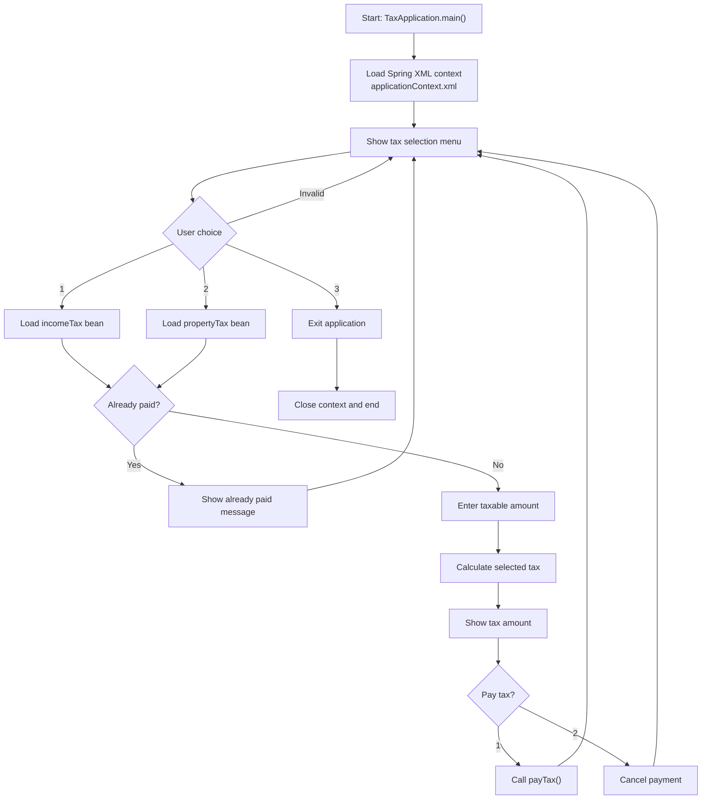

# Spring Tax Calculator

Spring Tax Calculator is a compact Java 17 project that demonstrates XML-based dependency injection with Spring and tax calculation logic for income tax and property tax. The current `main` branch represents `v3`, which extends the `v2` interactive console flow with paid-status tracking during the current app session.

## GitHub Metadata

- Suggested repository description: `V3 of a Java 17 Spring project demonstrating XML-based dependency injection, interactive console flow, and in-session tax payment tracking.`
- Suggested topics: `java`, `java-17`, `spring-framework`, `maven`, `xml-configuration`, `dependency-injection`, `junit5`, `oop`, `console-application`, `tax-calculator`, `learning-project`

## Tech Stack

- Java 17
- Maven
- Spring Framework XML configuration
- JUnit 5

## Project Overview

This version keeps the same contract-driven tax model from `v1` and extends the `v2` console interaction with session-level tax payment tracking:

- `Tax` defines the common behavior for tax implementations.
- `IncomeTax` calculates tax using simplified slab-based logic.
- `PropertyTax` calculates tax as 5% of the property value.
- `applicationContext.xml` wires both implementations as Spring beans.
- `TaxConsoleWorkflow` drives a menu where the user selects a tax type, enters the taxable amount, reviews the result, optionally pays it, and is prevented from paying the same tax twice in one runtime session.

## Current Flow

1. The application starts in `TaxApplication`.
2. Spring loads `applicationContext.xml`.
3. The console workflow shows a menu for income tax, property tax, or exit.
4. The user selects a tax type.
5. The application checks whether that tax was already paid in the current session.
6. If not yet paid, the application asks for the taxable amount and calculates the tax.
7. The application shows the amount and asks whether to pay it.
8. If the tax is already paid, the application shows an informational message and returns to the menu.
9. The user can continue with another tax flow or exit the application.

## Flow Diagram



## How To Run

```bash
mvn test
mvn package
java -jar target/spring-tax-calculator-0.0.1-SNAPSHOT.jar
```

If you prefer the Maven Wrapper, use `mvnw.cmd` on Windows or `./mvnw` on Unix-like systems.

## Sample Output

```text
Welcome to the Tax Payment Application
Please select which tax you want to pay:
1. Income
2. Property
3. Exit
Please enter your income value:
You have selected income tax and your tax amount is: 180000.0
Do you want to pay the tax?
1. Yes
2. No
Hi, your income tax is paid.
Please select which tax you want to pay:
1. Income
2. Property
3. Exit
You have already paid income tax.
Please select which tax you want to pay:
1. Income
2. Property
3. Exit
Exiting...
```

## Known Limitations

- Income tax currently uses simplified slab logic, meaning one rate is applied to the full amount in a bracket.
- The project is a console-based demonstration and does not expose a REST API.
- Tax payment state is stored only in memory and is reset each time the application starts.
- Because Spring beans are singleton-scoped by default, payment state persists during one runtime session for each tax bean.
- Paid status is not stored permanently, so restarting the application resets both tax beans to unpaid.
- There is no persistence layer or external data source in `v3`.

## Future Versions Roadmap

- `v1`: fixed demo run using XML bean wiring and hardcoded taxable amounts. Tagged as `v1.0.0`.
- `v2`: interactive console-based tax selection, calculation, and optional payment flow. Tagged as `v2.0.0`.
- `v3`: interactive console flow with already-paid detection for each tax bean during one runtime session.

## Why This Repo Exists

This repository is intended as a learning and portfolio project that shows:

- interface-based design
- basic Spring bean configuration
- simple business-logic implementation
- incremental project evolution across versions
