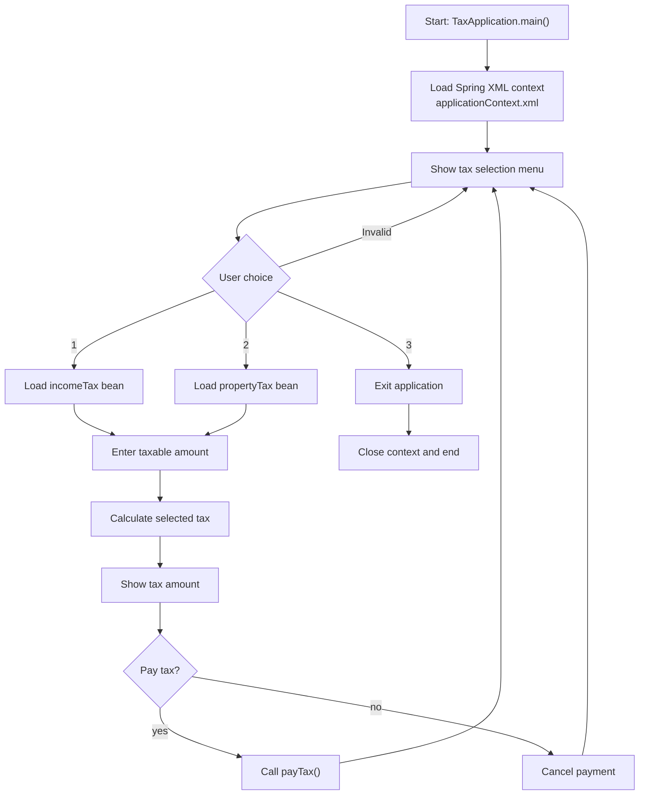

# Spring Tax Calculator

Spring Tax Calculator is a compact Java 17 project that demonstrates XML-based dependency injection with Spring and tax calculation logic for income tax and property tax. The current `main` branch represents `v2`, which adds an interactive console workflow on top of the original `v1` demo.

## GitHub Metadata

- Suggested repository description: `V2 of a Java 17 Spring project demonstrating XML-based dependency injection, interactive console flow, and basic income/property tax calculation.`
- Suggested topics: `java`, `java-17`, `spring-framework`, `maven`, `xml-configuration`, `dependency-injection`, `junit5`, `oop`, `console-application`, `tax-calculator`, `learning-project`

## Tech Stack

- Java 17
- Maven
- Spring Framework XML configuration
- JUnit 5

## Project Overview

This version keeps the same contract-driven tax model from `v1` and extends it with a simple menu-based user interaction flow:

- `Tax` defines the common behavior for tax implementations.
- `IncomeTax` calculates tax using simplified slab-based logic.
- `PropertyTax` calculates tax as 5% of the property value.
- `applicationContext.xml` wires both implementations as Spring beans.
- `TaxConsoleWorkflow` drives a menu where the user selects a tax type, enters the taxable amount, reviews the result, and optionally pays it.

## Current Flow

1. The application starts in `TaxApplication`.
2. Spring loads `applicationContext.xml`.
3. The console workflow shows a menu for income tax, property tax, or exit.
4. The user selects a tax type.
5. The application asks for the taxable amount.
6. The selected implementation calculates the tax amount.
7. The application shows the amount and asks whether to pay it.
8. The user can continue with another tax flow or exit the application.

## Flow Diagram



## How To Run

```bash
mvn test
mvn package
java -jar target/spring-tax-calculator-0.0.1-SNAPSHOT.jar
```

If you prefer the Maven Wrapper, use `mvnw.cmd` on Windows or `./mvnw` on Unix-like systems.

## Sample Output

```text
Welcome to the Tax Payment Application
Please select which tax you want to pay:
1. Income
2. Property
3. Exit
Selected Tax Type: income
Enter the taxable amount:
Tax Amount: 180000.0
Hi, your income tax is paid.
Exiting...
```

## Known Limitations

- Income tax currently uses simplified slab logic, meaning one rate is applied to the full amount in a bracket.
- The project is a console-based demonstration and does not expose a REST API.
- Tax payment state is stored only in memory and is reset each time the application starts.
- Because Spring beans are singleton-scoped by default, payment state persists during one runtime session for each tax bean.
- There is no persistence layer or external data source in `v2`.

## Future Versions Roadmap

- `v1`: fixed demo run using XML bean wiring and hardcoded taxable amounts. Tagged as `v1.0.0`.
- `v2`: interactive console-based tax selection, calculation, and optional payment flow.
- `v3`: planned enhancement that continues the same project history.

## Why This Repo Exists

This repository is intended as a learning and portfolio project that shows:

- interface-based design
- basic Spring bean configuration
- simple business-logic implementation
- incremental project evolution across versions
